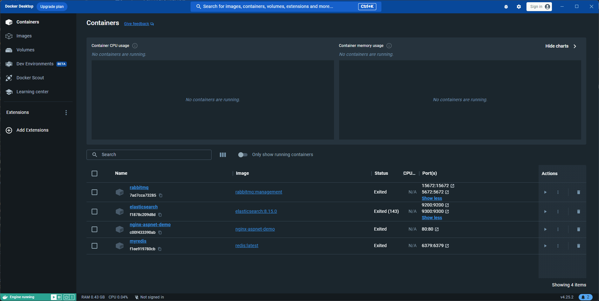
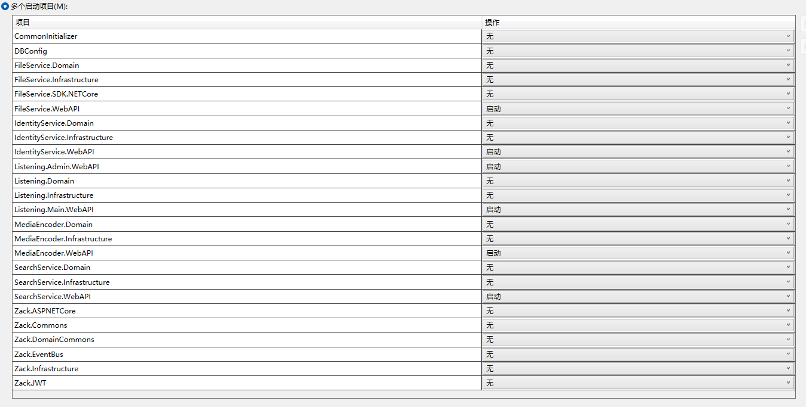
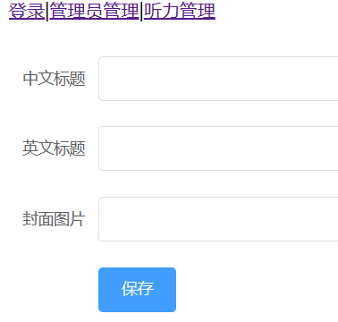
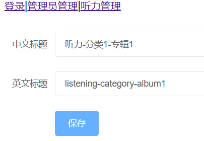
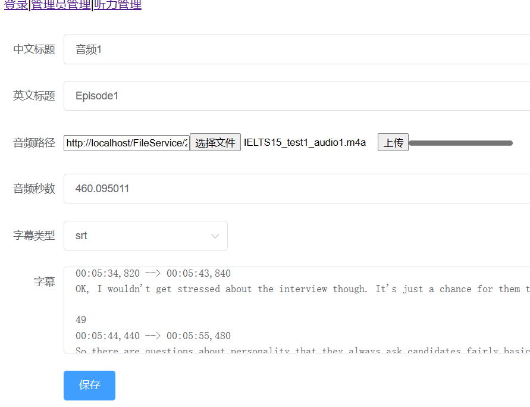

# aspnet-demo-englishLearnningWeb

基于 aspnet 英语听力网站的开发。

## 如何运行此项目

此项目是基于asp.net的综合项目，所有服务器通过Dcoker均运行在本地。  

主要技术涉及 asp.net core, webapi, elasticsearch, readis, nginx，  

[后端服务运行配置](./docs/项目运行环境配置.md): 系统环境配置，对应软件安装，对应软件的Docker配置  

[前端服务运行配置](./docs/项目前端运行配置.MD): 如何编译前端项目，以及对应的启动  

### 启动Docker上的服务

  

也许用命令行显得更加牛掰，但是还是怎么简单怎么来；

**注意：**  
nginx服务需要做特殊修改，直接使用官方上的nginx是没法办法执行的。[参考](./docs/项目运行环境配置.md#配置nginx)

### 启动Visual Studio上的WebAPI服务

直接设置VS上的多个启动项目，将服务一起起来，就可以同时进行调试。  
当然你也可以一个一个启动。  
注意，使用Debug模式打开会打开swagger。  

### 启动前端项目

建议先运行管理员，添加数据在运行用户前端，前端并没有做太多的错误提示，如果发现出现问题，请F12检查是什么原因。  
前端项目有两个模块，一个是管理员前端，一个普通用户前端。  
具体启动方式 [参考](./docs/项目前端运行配置.MD#项目前端运行配置)

### 创建一个管理员账号

如果是第一次打开，请主动创建一个管理员账号进行测试。  
可通过  post /Login/CreateWorld 接口来直接创建一个管理账号进行测试。

### 登录管理员账号添加听力音频

第一步：创建分类

  

第二步：创建专辑

  

保存后，注意要将专辑打开，否者不会再用户界面上显示

第三步：创建专辑

  

### 启动用户前端查看音频

**注意**：管理员前端和用户前端目前均使用的一样的端口号。

## 项目演示

施工中.gif