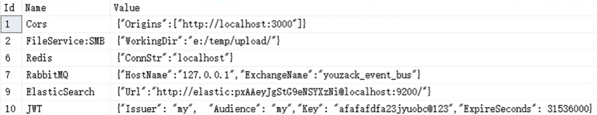

# 项目运行环境配置

主要描述本项目启动配置。 会说明从原生项目进行配置的时候所需要的问题。  

## 如何启动程序

- [安装SQLServer](#sqlserver)
- [配置环境变量](#配置系统环境变量)
- [配置EFCore](#配置efcore)
- [配置T_Congfig](#配置t_configs数据库表)
- [配置Elasticsearch](#配置elasticsearch)
- [配置Redis](#配置redis)
- [配置Nginx](#配置nginx)

## SQLServer

### 安装SQLServer

微软的SQlServer这么方便安装，应该不用再说什么了吧。  
本地安装就完事其他不用管，都是EFCore完成配置。

## 配置环境变量

### 配置系统环境变量

因为该项目主要是测试学习项目，为了方便，多个微服务统一调用系统的环境变量 “DefaultDB:ConnStr” 。  
多个微服务都从其中获取字符串数据库字符串连接。  

```powershell
# 添加到用户变量
[System.Environment]::SetEnvironmentVariable("DefaultDB:ConnStr", "Server=.;Database=aspnet-demo;Trusted_Connection=True;TrustServerCertificate=True;", "User")
# 添加到系统变量
[System.Environment]::SetEnvironmentVariable("DefaultDB:ConnStr", "Server=.;Database=aspnet-demo;Trusted_Connection=True;TrustServerCertificate=True;", "Machine")
# 两者选一个
```

### 配置数据库中的基础表数据

在数据中增加一个名字为 T_Configs 的表：  

| Id | Name | Value |
| -- | Cors | |
| -- | FileService:SMB |  |
| -- | FileService:UPYun | |
| -- | FileService:Endpoint | |
| -- | Redis | |
| -- | RabbitMQ | |
| -- | ElasticSearch | |
| -- | JWT | |



Cors: 跨域，前端项目跨域问题；
FileService:SMB：文件服务器保存位置；  
FileService:UPYun：上传云（U盘云？）？没有用到，可以暂时不用配置；  
FileService:Endpoint：文件服务器的路径；  
RabbitMQ：服务器地址；  
ElasticSearch：服务器地址；  
JWT：配置设定

## 配置EFCore

```.NET CLI
# 创建第一个迁移
dotnet ef migrations add InitialCreate
# 创建数据库和架构
dotnet ef database update
```

针对以下项目每个都执行一次：  
- FileService.Infrastructure
- IdentityService.Infrastructure
- Listening.Infrastructure
- MediaEncoder.Infrastructure
- SearchService.Infrastructure

跟原项目相比，我重新划分了一下文件夹

### 执行 FileService.Infrastructure 问题

#### 第1次执行 - FileService

```powshell
dotnet ef migrations add InitialCreate
```
错误：  
FileService.InfrastructureYour startup project 'FileService.Infrastructure' doesn't reference Microsoft.EntityFrameworkCore.Design. This package is required for the Entity Framework Core Tools to work. Ensure your startup project is correct, install the package, and try again.

解决：  
引入 Microsoft.EntityFrameworkCore.Tools Nuget包即可

#### 第2次执行 - FileService  

```powshell
dotnet ef migrations add InitialCreate
```
错误：  
Unable to create an object of type 'FSDbContext'. For the different patterns supported at design time, see https://go.microsoft.com/fwlink/?linkid=851728

解决：  
https://learn.microsoft.com/zh-cn/ef/core/cli/dbcontext-creation?tabs=dotnet-core-cli#from-a-design-time-factory  

问题主要是找不到所连接的数据库。因为代码没有在 DbContext派生类 中配置连接数据库信息。
官网这里说得挺明确的，使用 IDesignTimeDbContextFactory 工具会绕过DbContext的其他方式。

在 FileService.Infrastructure 项目中创建以下代码
```CSharp
public class FSDbContextFactory : IDesignTimeDbContextFactory<FSDbContext>
{
    public FSDbContext CreateDbContext(string[] args) 
    {
        // DbContextOptionsBuilderFactor 需要引用 CommonInitializer 从中所连接的字符串
        var dbOptions = DbContextOptionsBuilderFactory.Create<FSDbContext>();
        return new FSDbContext(dbOptions.Options, null);
    }
}
```

#### 第3次执行 - FileServers

```powshell
# 生成迁移文件
dotnet ef migrations add InitialCreate
# 形成数据库
dotnet ef database update
```

其他项目也都参考这样。

### 执行 IdentityService.Infrastructure 问题

因为 IdentityService.Infrastructure 项目的继承类稍微有点不一样。生成代码有些改变。

```CSharp
public class IdDbContextFactory : IDesignTimeDbContextFactory<IdDbContext>
{
    public IdDbContext CreateDbContext(string[] args) 
    {
        var dbOptions = DbContextOptionsBuilderFactory.Create<IdDbContext>();
        return new IdDbContext(dbOptions.Options);
    }
}
```

## 配置T_Configs数据库表

T_Configs 数据表是保存服务所需要的一些配置设置。  
在这里，我创建了一个 DBConfig 项目去生成 T_Configs 去快速生成，以及更新。  

- 跟上面生成数据库的步骤一致。
- 然后运行下一个这个控制台，就能初始化一些数据。

### 相关参数说明

#### Cors参数

```CSharp
public class CorsOptions
{
    public List<string> Origins { get; set; }
    public static CorsOptions InitCorsOptions()
    {
        CorsOptions options = new CorsOptions()
        {
            Origins = new List<string> { "http://localhost:3000", "http://localhost:3001" }
        };
        return options;
    }
}
```

#### FileServer:EndPoint 参数

```CSharp
public class FsEndPointOptions
{
    public System.Uri? UriRoot { get;private set; }
    public static FsEndPointOptions Init()
    {
        return new FsEndPointOptions()
        {
            UriRoot = new Uri("http://localhost/FileService"),
        };
    }
}
```

#### Redis 参数

```CSharp
public class RedisOptions
{
    public string ConnStr { get; set; }

    public static RedisOptions Init()
    {
        RedisOptions redisOptions = new RedisOptions()
        {
            // docker redis 6379 为默认端口
            ConnStr = "localhost:6379"
        };
        return redisOptions;
    }
}
```

#### RabbitMQ 参数

```CSharp

```
#### ElasticSearch参数

NybWpE3*WqPhloQVxsuU

## 配置Elasticsearch

常规启动：  

```powshell
docker run -d --name elasticsearch -p 9200:9200 -p 9300:9300 -e "discovery.type=single-node" elasticsearch:8.15.0
```

- -d：后台运行容器。
- --name elasticsearch：容器名称为 elasticsearch。
- -p 9200:9200：将容器的 9200 端口映射到主机的 9200 端口（HTTP REST 接口）。
- -p 9300:9300：将容器的 9300 端口映射到主机的 9300 端口（用于节点之间的通信）。
- -e "discovery.type=single-node"：指定 ElasticSearch 以单节点模式运行（适用于开发和测试环境）。

禁用用户认证：

```powshell
docker run -d --name elasticsearch -e "discovery.type=single-node" -e "xpack.security.enabled=false" -p 9200:9200 -p 9300:9300 elasticsearch:8.15.0
```

ElasticSearch 8.x 版本默认启用了安全功能，这意味着访问 http://localhost:9200 时可能需要提供认证信息。  
如果不禁用认证，可能不能够直接用浏览器访问此网站。   

## 配置Redis

Redis直接使用Docker

```powshell
docker pull redis  
docker run -p 6379:6379 --name myredis -d redis:latest  
```

## 配置 RabbitMQ

RabbitMQ直接使用Docker启动

[RabbitMQ](https://hub.docker.com/_/rabbitmq)  

https://www.cnblogs.com/shenghuotaiai/p/16170319.html

```powshell
docker run -d --name rabbitmq -p 5672:5672 -p 15672:15672 rabbitmq:management
```

-d：后台运行容器。
--name rabbitmq：容器名称为 rabbitmq。
-p 5672:5672：将容器的 5672 端口映射到主机的 5672 端口（AMQP 协议端口，用于消息通信）。
-p 15672:15672：将容器的 15672 端口映射到主机的 15672 端口（RabbitMQ 管理界面的端口）。

如果本机5672或者15672被占用，可以尝试修改一下对应端口

rabbitmq:management：只有使用这个，才能够打开 rabbitmq web管理界面

[RabbitMQ Web管理页面打不开](RabbitMQ.md#web管理页面打不开)

## 配置Nginx

[nginx-down](https://nginx.org/en/download.html)

https://hub.docker.com/_/nginx

### Nginx-Docker-配置

```powershell
docker build --pull --rm -f "docker\nginx\Dcokerfile" -t nginx-aspnet-demo "docker\nginx"
docker run --name nginx-aspnet-demo -p 80:80 -d nginx-aspnet-demo 
```

- 第一条命令，是将创建一个新的镜像，并将配置文件打包进来   

特别说明：因为nginx是在docker中启动的，在nginx.conf中的localhost，需要修改成宿主机的地址，才能访问到宿主机中启动的地址

#### 生成新的Nginx镜像

如果没法执行，可以使用VSCode安装Docker插件，右键Dockerfile文件 -> build image，在这里我给镜像命名为 nginx-aspnet-demo 

