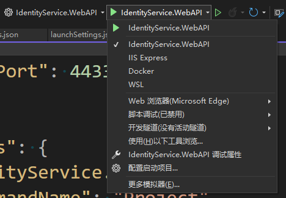

# 项目运行问题说明

## 如何启动项目

- 完成[项目运行环境配置](项目运行环境配置.md)
- 完成[项目前端运行配置](项目前端运行配置.MD)
- 启动Docker服务，myredis, nginx, rabbitmq, elasticsearch
- visual studio 多项目启动全部服务器
- （首次）通过swagger中的IdentityService.WebAPI CreateWorld [创建一个账号](#创建一个默认管理员账号)
- 登录错误（F12查看），主要是因为nginx配置的端口号不符, 这个时候我们要重新配置一下[服务器的端口](#重新配置swagger端口号)


## 创建一个默认管理员账号

visual studio 启动 IdentityService 服务后，启动

运行服务器后，可以在 [IdentityService.WebAPI](https://localhost:44332/swagger/index.html) 执行 CraeteWorld 创建一个登陆账号

## 重新配置Swagger端口号

举例说明，以下是 IdentityService.WebAPI 项目中的 launchSettings.json 文件的代码

```json
{
  "$schema": "https://json.schemastore.org/launchsettings.json",
  "iisSettings": {
    "windowsAuthentication": false,
    "anonymousAuthentication": true,
    "iisExpress": {
      "applicationUrl": "http://localhost:50402/",
      "sslPort": 44332
    }
  },
  "profiles": {
    "IdentityService.WebAPI": {
      "commandName": "Project",
      "launchBrowser": true,
      "launchUrl": "swagger",
      "environmentVariables": {
        "ASPNETCORE_ENVIRONMENT": "Development"
      },
      "applicationUrl": "https://localhost:5001;http://localhost:5000",
      "dotnetRunMessages": true
    },
    "IIS Express": {
      "commandName": "IISExpress",
      "launchBrowser": true,
      "launchUrl": "swagger",
      "environmentVariables": {
        "ASPNETCORE_ENVIRONMENT": "Development"
      }
    },
    "Docker": {
      "commandName": "Docker",
      "launchBrowser": true,
      "launchUrl": "{Scheme}://{ServiceHost}:{ServicePort}/swagger",
      "publishAllPorts": true,
      "useSSL": true
    }
  }
}
```

我们要针对每个项目选择正确的启动项目，修改起对应的端口号，跟nginx的配置一致

